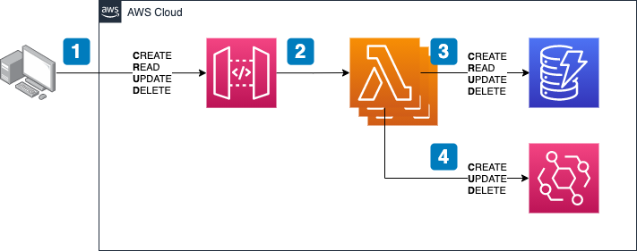
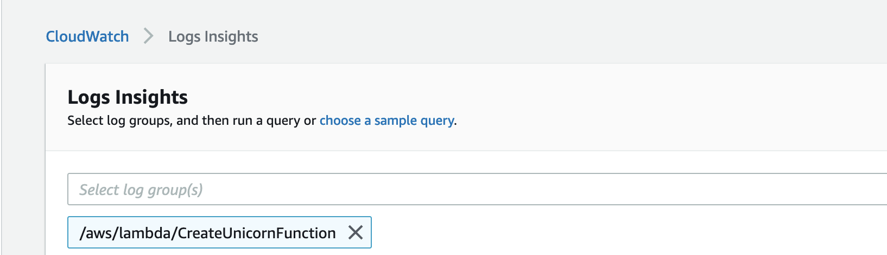
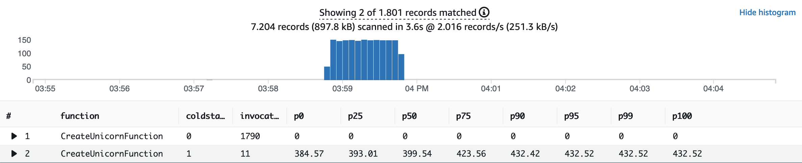
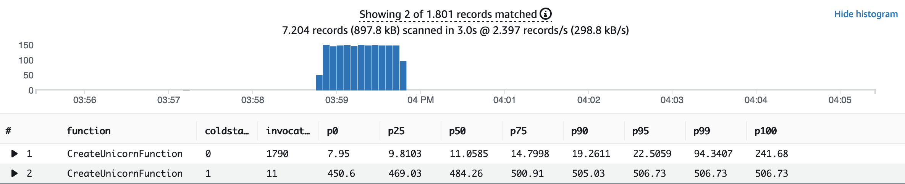

# AWS Lambda hexagonal architecture on GraalVM example

## Architecture of this example application



## Install prerequisite software:

1. Install [AWS CDK](https://docs.aws.amazon.com/cdk/latest/guide/getting_started.html)
2. Install [Apache Maven](https://maven.apache.org/install.html) (or use your preferred IDE)
3. Install [Docker](https://docs.docker.com/get-docker/)


## Getting started

Download or clone the repository and navigate to the projects root directory:

```bash
cd aws-lambda-hexagonal-architecture-on-graal
```

## Build the Docker software build container image

```bash
docker build -t al2-graalvm:maven .
```

## Deploy the example application

Synthesize CDK. This previews changes to your AWS account before you validate the result:

```bash
cd infrastructure
cdk synth
```

If you are happy with the result, deploy the Lambda functions:

```bash
cdk deploy --outputs-file target/outputs.json
```

The API Gateway endpoint URL is displayed in the output and saved in a file named outputs.json. The contents are similar to:

```json
{
  "UnicornStoreStack": {
    "apiendpoint": "https://{YOUR_UNIQUE_ID_HERE}.execute-api.{YOUR_SELECTED_AWS_REGION}.amazonaws.com/prod/"
  }
}
```

## Using cURL to test the endpoints

Execute the following command inside the `infrastructure` directory:

```bash
curl -XPOST -i -d '{"name":"Big Unicorn","age":"13","type":"Beautiful","size":"196 cm"}' $(cat target/outputs.json | jq -r '.UnicornStoreStack.apiendpoint')/unicorns
```

From the received response body, take the unicorn id and replace the "{ID}" in the below commands to read, update and delete the newly created unicorn:

```bash
curl -i $(cat target/outputs.json | jq -r '.UnicornStoreStack.apiendpoint')/unicorns/{ID}

curl -XPUT -i -d '{"name":"Biggest Unicorn","age":"13","type":"Beautiful","size":"314 cm"}' $(cat target/outputs.json | jq -r '.UnicornStoreStack.apiendpoint')/unicorns/{ID}

curl -XDELETE -i $(cat target/outputs.json | jq -r '.UnicornStoreStack.apiendpoint')/unicorns/{ID}
```

## Using Artillery to load test the creation of new unicorns

First, install prerequisites:

1. Install [jq](https://stedolan.github.io/jq/) 
2. Install [Artillery Core](https://artillery.io/docs/guides/getting-started/installing-artillery.html)
3. Run the following script from the `/infrastructure` directory, to create 1800 items:

```bash
artillery run -t $(cat target/outputs.json | jq -r '.UnicornStoreStack.apiendpoint') -v '{ "url": "/unicorns" }' loadtest.yml
```

### Check results in Amazon CloudWatch Insights

1. Navigate to [Amazon CloudWatch Logs Insights](https://console.aws.amazon.com/cloudwatch/home?#logsV2:logs-insights).
2. Select the following log group from the drop-down list:

```
/aws/lambda/CreateUnicornFunction
```



3. Copy the following query and choose **Run query**:

```
filter @type = "REPORT"
   | parse @log /\d+:\/aws\/lambda\/(?<function>.*)/
   | stats
   count(*) as invocations,
   pct(coalesce(@initDuration,0), 0) as p0,
   pct(coalesce(@initDuration,0), 25) as p25,
   pct(coalesce(@initDuration,0), 50) as p50,
   pct(coalesce(@initDuration,0), 75) as p75,
   pct(coalesce(@initDuration,0), 90) as p90,
   pct(coalesce(@initDuration,0), 95) as p95,
   pct(coalesce(@initDuration,0), 99) as p99,
   pct(coalesce(@initDuration,0), 100) as p100
   group by function, ispresent(@initDuration) as coldstart
   | sort by coldstart, function
```

Init (cold-start) duration only:



4. Copy the following query and choose **Run query**:

```
filter @type = "REPORT"
   | parse @log /\d+:\/aws\/lambda\/(?<function>.*)/
   | stats
   count(*) as invocations,
   pct(@duration+coalesce(@initDuration,0), 0) as p0,
   pct(@duration+coalesce(@initDuration,0), 25) as p25,
   pct(@duration+coalesce(@initDuration,0), 50) as p50,
   pct(@duration+coalesce(@initDuration,0), 75) as p75,
   pct(@duration+coalesce(@initDuration,0), 90) as p90,
   pct(@duration+coalesce(@initDuration,0), 95) as p95,
   pct(@duration+coalesce(@initDuration,0), 99) as p99,
   pct(@duration+coalesce(@initDuration,0), 100) as p100
   group by function, ispresent(@initDuration) as coldstart
   | sort by coldstart, function
```

Init (cold-start) + function execution duration:



> To recap: It took only 450 ms to 1/ find a new execution environment for our Lambda function, 2/ provision it (downloading our business logic), 3/ initialize our function, 4/ insert our item into DynamoDB and 5/ send the event to EventBridge. Wow!

## Security

See [CONTRIBUTING](CONTRIBUTING.md#security-issue-notifications) for more information.

## License

This library is licensed under the MIT-0 License. See the LICENSE file.

